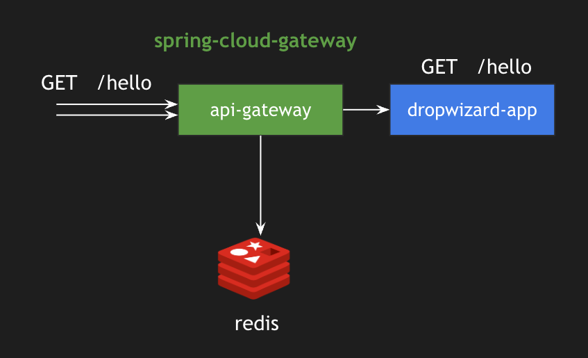

# Rate Limiter using Spring Cloud Gateway

## Architecture


## Code Changes

The following config enables rate limiters and routes the traffic to backend instance which is a dropwizard app.
This app runs on `8082` port.

```
spring:
  redis:
    host: localhost
    port: 6379
  application:
    name: ratelimiter-example
  cloud:
    gateway:
      routes:
        - id: route1
          uri: http://localhost:8080/hello
          predicates:
            - Path=/hello
          filters:
            - name: RequestRateLimiter
              args:
                redis-rate-limiter.replenishRate: 20
                redis-rate-limiter.burstCapacity: 40
                redis-rate-limiter.requestedTokens: 1
```